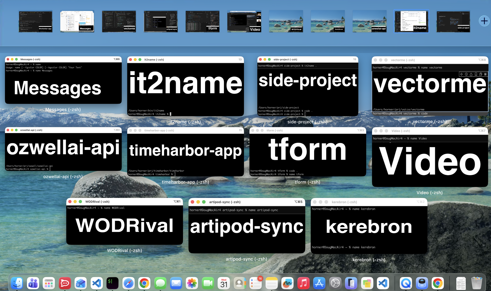

# it2name

A simple iTerm2 helper that renders big ASCII art captions and sets the terminal tab title.

## Demo



📹 [Watch video demo](https://youtube.com/shorts/ENH4IveFZEo) 

## What it does

`it2name` takes text input and:
1. Renders it as large ASCII art using ImageMagick + chafa
2. Sets your iTerm2 tab/session name to that text
3. Prints the current working directory

Perfect for visually identifying terminal tabs or creating eye-catching terminal banners.

## Dependencies

- **ImageMagick** - for text rendering
- **chafa** - for terminal graphics

## Installation

### Via Homebrew

```bash
brew install horner/tap/it2name
```

This will automatically install ImageMagick and chafa as dependencies.

### Manual Installation

1. Install dependencies:
   ```bash
   brew install imagemagick chafa
   ```

2. Copy `it2name` to a directory in your PATH:
   ```bash
   curl -o /usr/local/bin/it2name https://raw.githubusercontent.com/horner/it2name/main/it2name
   chmod +x /usr/local/bin/it2name
   ```

## Usage

Basic usage:
```bash
it2name "Hello World"
```

Use current directory name:
```bash
it2name .
```

Custom colors:
```bash
it2name --fgcolor red --bgcolor black "Production"
it2name --bgcolor blue --fgcolor white "Development"
```

### Options

- `--fgcolor COLOR` - Set foreground (text) color (default: white)
- `--bgcolor COLOR` - Set background color (default: black)
- `--version` - Show version information
- `--help` - Show usage information

Colors can be any ImageMagick-supported color name (e.g., red, blue, green, yellow, white, black, etc.)

## Examples

Mark your production terminal:
```bash
it2name --fgcolor yellow --bgcolor red "⚠️ PRODUCTION"
```

Label a project workspace:
```bash
cd ~/projects/myapp
it2name .
```

## License

MIT License - see [LICENSE](LICENSE) file for details.
